**Goal:** use osmnx to do some cool graph clustering and plot things.

Let's get started. Simply install osmnx with:

`conda install -c conda-forge osmnx` 
or 

`pip install osmnx`

Then import the module:


```python
import osmnx as ox
```

On my ubuntu machine, the installation went really well (I needed to update my LD_LIBRARY_PATH in by `.bashrc`, but nothing major). If you also managed to get everything working well, then keep on reading. If not, checkout this other post where I explore some difficulties that I had.


I had major issues with OSX though. I use my linux box for work, and then try out fun things on OSX at home because I love the idea of being able to use OSX for everything.

After having some success on my linux box with OSMNX at work, I decided to get things running natively on OSX and do some fun things at home. I had some icecream, put on some music, and was immediately stopped in my tracks by dependency issues. Typical. I think it was something wrong with how I had conda set up based on [this](https://github.com/conda-forge/osmnx-feedstock/issues/14) thread. Fiona and GDAL were there as usual. Typcial resolutions to this are hours of reading forums and learning more about conda channels, but I lost patience. But the I remembered that I've been meaning to start playing around more with Docker! Someone has thankfully made a [docker](https://github.com/garborg/docker-geopy/blob/master/build.sh) for *exactly* this dependency reason!


First, if you've ever jumped through the hoops to install a module only to be hit with dependency issues, then you should definitely consider docker. Even though Conda is *supposed* to solve this problem, it doesn't do it simply enough to stop me and other hacks from running into trouble. Take a look at this Dockerfile:

```
FROM jupyter/scipy-notebook

USER root

RUN apt-get update && \
    apt-get install -y libgeos-dev && \
    apt-get clean && \
    rm -rf /var/lib/apt/lists/*

# geopandas pulls in basically the whole python geo ecosystem
# temporarily downgrade geos to work around fiona compatibility issue
RUN conda install -y -c conda-forge geopandas osmnx && \
    conda install -y -c conda-forge geos=3.5.0 && \
    conda clean -tipsy && \
    find /opt -name __pycache__ | xargs rm -r && \
    rm -rf /opt/conda/pkgs/*

USER $NB_USER
```

See how it temporarily downgrades geos to work around fiona compatibility issues? That's so great. No one else should have to do that, so this lovely person has made a docker file. 

So, this post is based on my first ever go at using someones docker image. I'm really excited to do more with it because I get really upset when I can't muck around with a new module just because of installation issues.

Anyway, osmnx is a really great module. It's designed to be simple to use. I think the author has struck a great balance between simplicity in use and power, although there are a few things I'd like to see done differently.


```python
G = ox.graph_from_place('Crete, NE', network_type='drive')
ox.plot_graph(G)
```


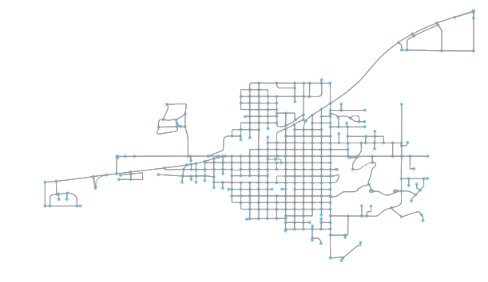


    (<matplotlib.figure.Figure at 0x11d8fccf8>,
     <matplotlib.axes._subplots.AxesSubplot at 0x11db3d630>)


That's a good plot. I'm going to start plotting it via Geopandas for the styling options.


```python
#https://gist.github.com/jgomezdans/402500


import matplotlib,numpy
import pylab
# A random colormap for matplotlib
cmap = matplotlib.colors.ListedColormap ( numpy.random.rand ( 256,3))
```


```python
gdf_nodes, gdf_edges = ox.graph_to_gdfs(G, nodes=True, edges=True, node_geometry=True, fill_edge_geometry=True)
```


```python
list(gdf_nodes.index)
```


    [135730174,
     135730180,
     135730188,
     135730203,
     135730208,
     135733338,
     135733366,
     135733381,
     135733483,
     135733506,
     135742584,
     135743459,
     135743466,
     135743686,
     135744037,
     135746665,
     135748097,
     135748114,
     135749653,
     135749659,
     135749696,
     135749763,
     135750436,
     135750664,
     135751056,
     135751303,
     135751313,
     135751318,
     135752015,
     135752061,
     135752065,
     135752422,
     135754177,
     135755616,
     135758210,
     135758246,
     135761936,
     135761946,
     135761999,
     135763194,
     135767062,
     135767071,
     135767083,
     135767889,
     135768461,
     135768463,
     135768946,
     135768949,
     135768953,
     135770626,
     135771141,
     135771151,
     135771532,
     135771680,
     135771692,
     135771790,
     135771794,
     135771797,
     135771892,
     135771894,
     135771896,
     135771899,
     135771904,
     135771910,
     135771996,
     135772002,
     135772011,
     135772031,
     135772118,
     135772145,
     135772163,
     135772166,
     135772169,
     135772172,
     135774672,
     135774681,
     135774683,
     135774711,
     135774714,
     135774717,
     135774720,
     135774724,
     135774726,
     135774730,
     135774740,
     135774747,
     135774750,
     135774752,
     135774778,
     135774780,
     135774784,
     135774786,
     135774793,
     135774795,
     135775027,
     135775041,
     135775043,
     135775046,
     135775048,
     135775050,
     135775052,
     135775056,
     135775065,
     135775068,
     135775071,
     135775073,
     135775081,
     135775084,
     135775087,
     135775107,
     135775485,
     135775501,
     135776041,
     135776061,
     135776063,
     135776068,
     135776071,
     135776074,
     135776077,
     135776080,
     135776083,
     135776086,
     135776092,
     135776095,
     135776109,
     135776111,
     135776116,
     135776121,
     135776141,
     135776143,
     135776171,
     135776173,
     135776189,
     135776193,
     135776196,
     135776198,
     135776202,
     135776207,
     135776220,
     135776223,
     135776242,
     135776244,
     135776246,
     135776248,
     135776392,
     135776396,
     135776411,
     135776441,
     135776456,
     135776461,
     135776787,
     135777798,
     135777799,
     135777801,
     135778741,
     135778745,
     135778753,
     135778778,
     135778780,
     135778782,
     135779000,
     135779013,
     135779017,
     135779019,
     135779021,
     135779027,
     135779030,
     135779033,
     135779036,
     135779041,
     135779045,
     135779050,
     135779059,
     135779064,
     135779067,
     135779068,
     135779070,
     135779118,
     135779122,
     135779214,
     135779230,
     135779233,
     135779241,
     135779246,
     135779263,
     135779278,
     135779281,
     135779288,
     135779290,
     135779350,
     135779353,
     135779355,
     135779357,
     135779559,
     135779595,
     135779598,
     135779606,
     135779618,
     135779667,
     135779669,
     135779671,
     135779703,
     135780252,
     135780691,
     135780925,
     135781417,
     135781420,
     135781432,
     135781474,
     135781517,
     135781520,
     135781522,
     135781524,
     135781526,
     135781530,
     135781572,
     135781574,
     135781576,
     135781581,
     135781593,
     135781604,
     135781633,
     135781651,
     135781676,
     135782525,
     135782528,
     135782535,
     135782553,
     135782557,
     135782578,
     135782726,
     135782728,
     135782730,
     135782734,
     135782765,
     135782770,
     135782772,
     135782775,
     135782781,
     135782785,
     135782792,
     135782829,
     135782835,
     135782838,
     135782841,
     135782843,
     135782866,
     135782873,
     135783732,
     135783741,
     135783937,
     135784017,
     135784056,
     135784068,
     135784096,
     135784114,
     135784118,
     135784145,
     135784148,
     135784867,
     135784971,
     135784994,
     135785037,
     135786443,
     135786447,
     135786466,
     135786540,
     135786548,
     135786604,
     135786605,
     135786608,
     135786828,
     135786831,
     135786845,
     135786851,
     135786853,
     135786860,
     135786863,
     135786866,
     135786868,
     135786870,
     135786873,
     135787094,
     135787100,
     135787105,
     135787139,
     135787154,
     135787321,
     135787325,
     135787386,
     135787393,
     135787461,
     135787517,
     135787532,
     135787724,
     135787735,
     135787855,
     135787953,
     135790344,
     135790455,
     135790482,
     135790487,
     135790529,
     135790852,
     135790858,
     135791224,
     135791236,
     135791512,
     135791525,
     135791527,
     135791533,
     135791535,
     135791537,
     135791542,
     135791554,
     135791585,
     135791589,
     135792587,
     135792821,
     135793642,
     135793713,
     135793958,
     135794102,
     135794103,
     135794141,
     135794157,
     135794449,
     135795546,
     135795553,
     135795623,
     135797076,
     135799559,
     135799563,
     135799721,
     135800342,
     135800354,
     135802780,
     135808984,
     135808990,
     135810287,
     135811652,
     135811704,
     135811763,
     135811780,
     135812972,
     135814626,
     135817291,
     135817315,
     135817324,
     1138631324,
     2704955667,
     2704955674,
     2704995802,
     2704995810,
     4418476466,
     4418476488,
     4421226420,
     4421226426,
     4421491127,
     4421491128,
     4428388190,
     4428388216,
     4758236398,
     4760126390,
     4760330941,
     4760330943,
     4760330950,
     4760330951,
     5084811283,
     5084811285,
     5084811288,
     5084811289,
     5084811293,
     5084811299,
     5084811302,
     5084811311,
     5084811313,
     5084811314,
     5084835856,
     5084835857,
     5084835859,
     5084835860,
     5084835865,
     5084835866,
     5084835871,
     5084835875,
     5084835876,
     5084835879,
     5084835883,
     5084835887,
     5084835889,
     5084835891,
     5084835892,
     5084835893,
     5142737787,
     5142737791]


```python
color_dict = dict(zip(gdf_nodes.index, list(map(cmap, range(len(gdf_nodes))))))
```


```python
def make_color_map(idxs):
    n_colors = len(idxs)
    cmap = matplotlib.colors.ListedColormap ( numpy.random.rand (n_colors,3))
    cmap_dict = {}
    for i, idx in enumerate(idxs):
        cmap_dict[idx] = cmap(i)
    return cmap_dict
    
    
cmap_lookup = make_color_map(set(gdf_nodes.index))
```


```python
gdf_nodes['color'] = list(map(lambda node: cmap_lookup[node], gdf_nodes.index)) # there's a nicer way to do this
```


```python
import numpy as np
import pandas as pd
import geopandas as gpd
import matplotlib.pyplot as plt
import networkx as nx
```


```python
def plot_gdfs(nodes, edges):

    fig, ax = plt.subplots(1, figsize=(7,7))

    base = edges.plot(ax=ax, color='gray', alpha=0.2)
    nodes.plot(ax=base, marker="o", c=nodes['color'])
    plt.show()
    
plot_gdfs(gdf_nodes, gdf_edges)
```


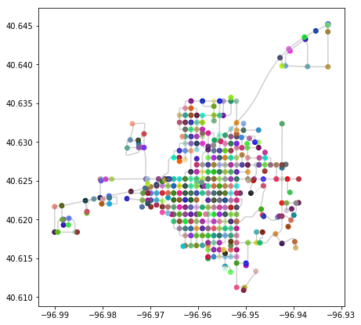


```python
gdf_edges
```


<div>
<style>
    .dataframe thead tr:only-child th {
        text-align: right;
    }

    .dataframe thead th {
        text-align: left;
    }

    .dataframe tbody tr th {
        vertical-align: top;
    }
</style>
<table border="1" class="dataframe">
  <thead>
    <tr style="text-align: right;">
      <th></th>
      <th>bridge</th>
      <th>geometry</th>
      <th>highway</th>
      <th>key</th>
      <th>lanes</th>
      <th>length</th>
      <th>name</th>
      <th>oneway</th>
      <th>osmid</th>
      <th>ref</th>
      <th>u</th>
      <th>v</th>
    </tr>
  </thead>
  <tbody>
    <tr>
      <th>0</th>
      <td>NaN</td>
      <td>LINESTRING (-96.968695 40.621888, -96.968677 4...</td>
      <td>residential</td>
      <td>0</td>
      <td>NaN</td>
      <td>69.078550</td>
      <td>Sycamore Avenue</td>
      <td>False</td>
      <td>14194603</td>
      <td>NaN</td>
      <td>135730174</td>
      <td>135730180</td>
    </tr>
    <tr>
      <th>1</th>
      <td>NaN</td>
      <td>LINESTRING (-96.968678 40.622509, -96.9686784 ...</td>
      <td>residential</td>
      <td>0</td>
      <td>NaN</td>
      <td>99.875413</td>
      <td>Sycamore Avenue</td>
      <td>False</td>
      <td>14194603</td>
      <td>NaN</td>
      <td>135730180</td>
      <td>135730188</td>
    </tr>
    <tr>
      <th>2</th>
      <td>NaN</td>
      <td>LINESTRING (-96.968678 40.622509, -96.968677 4...</td>
      <td>residential</td>
      <td>0</td>
      <td>NaN</td>
      <td>69.078550</td>
      <td>Sycamore Avenue</td>
      <td>False</td>
      <td>14194603</td>
      <td>NaN</td>
      <td>135730180</td>
      <td>135730174</td>
    </tr>
    <tr>
      <th>3</th>
      <td>NaN</td>
      <td>LINESTRING (-96.968678 40.622509, -96.969137 4...</td>
      <td>residential</td>
      <td>0</td>
      <td>NaN</td>
      <td>99.888899</td>
      <td>West 10th Street</td>
      <td>False</td>
      <td>14198984</td>
      <td>NaN</td>
      <td>135730180</td>
      <td>135779230</td>
    </tr>
    <tr>
      <th>4</th>
      <td>NaN</td>
      <td>LINESTRING (-96.968678 40.622509, -96.96844400...</td>
      <td>residential</td>
      <td>0</td>
      <td>NaN</td>
      <td>102.302773</td>
      <td>West 10th Street</td>
      <td>False</td>
      <td>14198984</td>
      <td>NaN</td>
      <td>135730180</td>
      <td>135779214</td>
    </tr>
    <tr>
      <th>5</th>
      <td>NaN</td>
      <td>LINESTRING (-96.9686784 40.6234072, -96.968678...</td>
      <td>residential</td>
      <td>0</td>
      <td>NaN</td>
      <td>104.723507</td>
      <td>Sycamore Avenue</td>
      <td>False</td>
      <td>14194603</td>
      <td>NaN</td>
      <td>135730188</td>
      <td>135730203</td>
    </tr>
    <tr>
      <th>6</th>
      <td>NaN</td>
      <td>LINESTRING (-96.9686784 40.6234072, -96.968678...</td>
      <td>residential</td>
      <td>0</td>
      <td>NaN</td>
      <td>99.875413</td>
      <td>Sycamore Avenue</td>
      <td>False</td>
      <td>14194603</td>
      <td>NaN</td>
      <td>135730188</td>
      <td>135730180</td>
    </tr>
    <tr>
      <th>7</th>
      <td>NaN</td>
      <td>LINESTRING (-96.9686784 40.6234072, -96.969293...</td>
      <td>residential</td>
      <td>0</td>
      <td>NaN</td>
      <td>100.569318</td>
      <td>West 11th Street</td>
      <td>False</td>
      <td>14199196</td>
      <td>NaN</td>
      <td>135730188</td>
      <td>135781526</td>
    </tr>
    <tr>
      <th>8</th>
      <td>NaN</td>
      <td>LINESTRING (-96.9686784 40.6234072, -96.968086...</td>
      <td>residential</td>
      <td>0</td>
      <td>NaN</td>
      <td>100.687557</td>
      <td>West 11th Street</td>
      <td>False</td>
      <td>14199196</td>
      <td>NaN</td>
      <td>135730188</td>
      <td>135781524</td>
    </tr>
    <tr>
      <th>9</th>
      <td>NaN</td>
      <td>LINESTRING (-96.96867880000001 40.624349, -96....</td>
      <td>residential</td>
      <td>0</td>
      <td>NaN</td>
      <td>104.723507</td>
      <td>Sycamore Avenue</td>
      <td>False</td>
      <td>14194603</td>
      <td>NaN</td>
      <td>135730203</td>
      <td>135730188</td>
    </tr>
    <tr>
      <th>10</th>
      <td>NaN</td>
      <td>LINESTRING (-96.96867880000001 40.624349, -96....</td>
      <td>residential</td>
      <td>0</td>
      <td>NaN</td>
      <td>18.031843</td>
      <td>Sycamore Avenue</td>
      <td>False</td>
      <td>14194603</td>
      <td>NaN</td>
      <td>135730203</td>
      <td>135730208</td>
    </tr>
    <tr>
      <th>11</th>
      <td>NaN</td>
      <td>LINESTRING (-96.96867880000001 40.624349, -96....</td>
      <td>residential</td>
      <td>0</td>
      <td>NaN</td>
      <td>100.534102</td>
      <td>West 12th Street</td>
      <td>False</td>
      <td>14199294</td>
      <td>NaN</td>
      <td>135730203</td>
      <td>135782734</td>
    </tr>
    <tr>
      <th>12</th>
      <td>NaN</td>
      <td>LINESTRING (-96.9687 40.624509, -96.9686761 40...</td>
      <td>residential</td>
      <td>0</td>
      <td>NaN</td>
      <td>18.031843</td>
      <td>Sycamore Avenue</td>
      <td>False</td>
      <td>14194603</td>
      <td>NaN</td>
      <td>135730208</td>
      <td>135730203</td>
    </tr>
    <tr>
      <th>13</th>
      <td>NaN</td>
      <td>LINESTRING (-96.9687 40.624509, -96.9680890000...</td>
      <td>primary</td>
      <td>0</td>
      <td>NaN</td>
      <td>111.935687</td>
      <td>West Highway 33</td>
      <td>False</td>
      <td>14200786</td>
      <td>NE 33;NE 103</td>
      <td>135730208</td>
      <td>135784068</td>
    </tr>
    <tr>
      <th>14</th>
      <td>NaN</td>
      <td>LINESTRING (-96.9687 40.624509, -96.9693307999...</td>
      <td>primary</td>
      <td>0</td>
      <td>NaN</td>
      <td>105.915046</td>
      <td>West Highway 33</td>
      <td>False</td>
      <td>14200786</td>
      <td>NE 33;NE 103</td>
      <td>135730208</td>
      <td>135799721</td>
    </tr>
    <tr>
      <th>15</th>
      <td>NaN</td>
      <td>LINESTRING (-96.9464983 40.6205897, -96.946569...</td>
      <td>living_street</td>
      <td>0</td>
      <td>NaN</td>
      <td>86.521834</td>
      <td>NaN</td>
      <td>False</td>
      <td>14194795</td>
      <td>NaN</td>
      <td>135733338</td>
      <td>135733366</td>
    </tr>
    <tr>
      <th>16</th>
      <td>NaN</td>
      <td>LINESTRING (-96.9464983 40.6205897, -96.946424...</td>
      <td>living_street</td>
      <td>1</td>
      <td>NaN</td>
      <td>31.420616</td>
      <td>NaN</td>
      <td>False</td>
      <td>14194795</td>
      <td>NaN</td>
      <td>135733338</td>
      <td>135733366</td>
    </tr>
    <tr>
      <th>17</th>
      <td>NaN</td>
      <td>LINESTRING (-96.9464983 40.6205897, -96.946507...</td>
      <td>living_street</td>
      <td>0</td>
      <td>NaN</td>
      <td>86.887866</td>
      <td>Osterhout Lane</td>
      <td>False</td>
      <td>483061832</td>
      <td>NaN</td>
      <td>135733338</td>
      <td>135752422</td>
    </tr>
    <tr>
      <th>18</th>
      <td>NaN</td>
      <td>LINESTRING (-96.9462558 40.6204177, -96.946266...</td>
      <td>living_street</td>
      <td>0</td>
      <td>NaN</td>
      <td>31.420616</td>
      <td>NaN</td>
      <td>False</td>
      <td>14194795</td>
      <td>NaN</td>
      <td>135733366</td>
      <td>135733338</td>
    </tr>
    <tr>
      <th>19</th>
      <td>NaN</td>
      <td>LINESTRING (-96.9462558 40.6204177, -96.946269...</td>
      <td>living_street</td>
      <td>1</td>
      <td>NaN</td>
      <td>86.521834</td>
      <td>NaN</td>
      <td>False</td>
      <td>14194795</td>
      <td>NaN</td>
      <td>135733366</td>
      <td>135733338</td>
    </tr>
    <tr>
      <th>20</th>
      <td>NaN</td>
      <td>LINESTRING (-96.9462558 40.6204177, -96.946079...</td>
      <td>living_street</td>
      <td>0</td>
      <td>NaN</td>
      <td>279.239913</td>
      <td>Osterhout Lane</td>
      <td>False</td>
      <td>14196174</td>
      <td>NaN</td>
      <td>135733366</td>
      <td>135733483</td>
    </tr>
    <tr>
      <th>21</th>
      <td>NaN</td>
      <td>LINESTRING (-96.948931 40.623411, -96.9489317 ...</td>
      <td>living_street</td>
      <td>0</td>
      <td>NaN</td>
      <td>190.049772</td>
      <td>Doane Drive</td>
      <td>False</td>
      <td>14201709</td>
      <td>NaN</td>
      <td>135733381</td>
      <td>135811704</td>
    </tr>
    <tr>
      <th>22</th>
      <td>NaN</td>
      <td>LINESTRING (-96.948931 40.623411, -96.9488807 ...</td>
      <td>living_street</td>
      <td>0</td>
      <td>NaN</td>
      <td>257.328791</td>
      <td>NaN</td>
      <td>True</td>
      <td>391857685</td>
      <td>NaN</td>
      <td>135733381</td>
      <td>4758236398</td>
    </tr>
    <tr>
      <th>23</th>
      <td>NaN</td>
      <td>LINESTRING (-96.9433312 40.6202937, -96.943386...</td>
      <td>living_street</td>
      <td>0</td>
      <td>NaN</td>
      <td>81.476875</td>
      <td>NaN</td>
      <td>False</td>
      <td>14194804</td>
      <td>NaN</td>
      <td>135733483</td>
      <td>135733506</td>
    </tr>
    <tr>
      <th>24</th>
      <td>NaN</td>
      <td>LINESTRING (-96.9433312 40.6202937, -96.943257...</td>
      <td>living_street</td>
      <td>1</td>
      <td>NaN</td>
      <td>40.382271</td>
      <td>NaN</td>
      <td>False</td>
      <td>14194804</td>
      <td>NaN</td>
      <td>135733483</td>
      <td>135733506</td>
    </tr>
    <tr>
      <th>25</th>
      <td>NaN</td>
      <td>LINESTRING (-96.9433312 40.6202937, -96.943382...</td>
      <td>living_street</td>
      <td>0</td>
      <td>NaN</td>
      <td>279.239913</td>
      <td>Osterhout Lane</td>
      <td>False</td>
      <td>14196174</td>
      <td>NaN</td>
      <td>135733483</td>
      <td>135733366</td>
    </tr>
    <tr>
      <th>26</th>
      <td>NaN</td>
      <td>LINESTRING (-96.94297709999999 40.6204325, -96...</td>
      <td>living_street</td>
      <td>0</td>
      <td>NaN</td>
      <td>46.125335</td>
      <td>Osterhout Lane</td>
      <td>False</td>
      <td>14197915</td>
      <td>NaN</td>
      <td>135733506</td>
      <td>135767889</td>
    </tr>
    <tr>
      <th>27</th>
      <td>NaN</td>
      <td>LINESTRING (-96.94297709999999 40.6204325, -96...</td>
      <td>living_street</td>
      <td>0</td>
      <td>NaN</td>
      <td>40.382271</td>
      <td>NaN</td>
      <td>False</td>
      <td>14194804</td>
      <td>NaN</td>
      <td>135733506</td>
      <td>135733483</td>
    </tr>
    <tr>
      <th>28</th>
      <td>NaN</td>
      <td>LINESTRING (-96.94297709999999 40.6204325, -96...</td>
      <td>living_street</td>
      <td>1</td>
      <td>NaN</td>
      <td>81.476875</td>
      <td>NaN</td>
      <td>False</td>
      <td>14194804</td>
      <td>NaN</td>
      <td>135733506</td>
      <td>135733483</td>
    </tr>
    <tr>
      <th>29</th>
      <td>NaN</td>
      <td>LINESTRING (-96.957881 40.629439, -96.957869 4...</td>
      <td>residential</td>
      <td>0</td>
      <td>NaN</td>
      <td>190.146309</td>
      <td>Juniper Avenue</td>
      <td>False</td>
      <td>14198715</td>
      <td>NaN</td>
      <td>135742584</td>
      <td>135776041</td>
    </tr>
    <tr>
      <th>...</th>
      <td>...</td>
      <td>...</td>
      <td>...</td>
      <td>...</td>
      <td>...</td>
      <td>...</td>
      <td>...</td>
      <td>...</td>
      <td>...</td>
      <td>...</td>
      <td>...</td>
      <td>...</td>
    </tr>
    <tr>
      <th>1166</th>
      <td>NaN</td>
      <td>LINESTRING (-96.9519141 40.622492, -96.952506 ...</td>
      <td>residential</td>
      <td>0</td>
      <td>NaN</td>
      <td>101.814280</td>
      <td>East 10th Street</td>
      <td>False</td>
      <td>191640292</td>
      <td>NaN</td>
      <td>5084835879</td>
      <td>135776456</td>
    </tr>
    <tr>
      <th>1167</th>
      <td>NaN</td>
      <td>LINESTRING (-96.9519172 40.621568, -96.9517751...</td>
      <td>living_street</td>
      <td>0</td>
      <td>NaN</td>
      <td>278.655139</td>
      <td>College Drive</td>
      <td>False</td>
      <td>14200036</td>
      <td>NaN</td>
      <td>5084835883</td>
      <td>5084835879</td>
    </tr>
    <tr>
      <th>1168</th>
      <td>NaN</td>
      <td>LINESTRING (-96.9519172 40.621568, -96.9519152...</td>
      <td>residential</td>
      <td>1</td>
      <td>NaN</td>
      <td>102.744604</td>
      <td>Boswell Avenue</td>
      <td>False</td>
      <td>391857689</td>
      <td>NaN</td>
      <td>5084835883</td>
      <td>5084835879</td>
    </tr>
    <tr>
      <th>1169</th>
      <td>NaN</td>
      <td>LINESTRING (-96.9519172 40.621568, -96.9525191...</td>
      <td>residential</td>
      <td>0</td>
      <td>NaN</td>
      <td>101.586057</td>
      <td>East 9th Street</td>
      <td>False</td>
      <td>191640294</td>
      <td>NaN</td>
      <td>5084835883</td>
      <td>5084835875</td>
    </tr>
    <tr>
      <th>1170</th>
      <td>NaN</td>
      <td>LINESTRING (-96.9519172 40.621568, -96.9519189...</td>
      <td>residential</td>
      <td>0</td>
      <td>NaN</td>
      <td>100.731824</td>
      <td>Boswell Avenue</td>
      <td>False</td>
      <td>391857689</td>
      <td>NaN</td>
      <td>5084835883</td>
      <td>135779036</td>
    </tr>
    <tr>
      <th>1171</th>
      <td>NaN</td>
      <td>LINESTRING (-96.95432719999999 40.621561, -96....</td>
      <td>residential</td>
      <td>0</td>
      <td>NaN</td>
      <td>103.411402</td>
      <td>Grove Avenue</td>
      <td>False</td>
      <td>14199697</td>
      <td>NaN</td>
      <td>5084835887</td>
      <td>135776461</td>
    </tr>
    <tr>
      <th>1172</th>
      <td>NaN</td>
      <td>LINESTRING (-96.95432719999999 40.621561, -96....</td>
      <td>residential</td>
      <td>0</td>
      <td>NaN</td>
      <td>98.082453</td>
      <td>Grove Avenue</td>
      <td>False</td>
      <td>14199697</td>
      <td>NaN</td>
      <td>5084835887</td>
      <td>135786853</td>
    </tr>
    <tr>
      <th>1173</th>
      <td>NaN</td>
      <td>LINESTRING (-96.95432719999999 40.621561, -96....</td>
      <td>residential</td>
      <td>0</td>
      <td>NaN</td>
      <td>97.297974</td>
      <td>East 9th Street</td>
      <td>False</td>
      <td>191640294</td>
      <td>NaN</td>
      <td>5084835887</td>
      <td>5084835889</td>
    </tr>
    <tr>
      <th>1174</th>
      <td>NaN</td>
      <td>LINESTRING (-96.95432719999999 40.621561, -96....</td>
      <td>residential</td>
      <td>0</td>
      <td>NaN</td>
      <td>101.820262</td>
      <td>East 9th Street</td>
      <td>False</td>
      <td>191640294</td>
      <td>NaN</td>
      <td>5084835887</td>
      <td>5084835875</td>
    </tr>
    <tr>
      <th>1175</th>
      <td>NaN</td>
      <td>LINESTRING (-96.95547999999999 40.621566, -96....</td>
      <td>residential</td>
      <td>0</td>
      <td>NaN</td>
      <td>98.596285</td>
      <td>Hawthorne Avenue</td>
      <td>False</td>
      <td>14198643</td>
      <td>NaN</td>
      <td>5084835889</td>
      <td>135775056</td>
    </tr>
    <tr>
      <th>1176</th>
      <td>NaN</td>
      <td>LINESTRING (-96.95547999999999 40.621566, -96....</td>
      <td>residential</td>
      <td>0</td>
      <td>NaN</td>
      <td>102.525913</td>
      <td>Hawthorne Avenue</td>
      <td>False</td>
      <td>14198643</td>
      <td>NaN</td>
      <td>5084835889</td>
      <td>135775065</td>
    </tr>
    <tr>
      <th>1177</th>
      <td>NaN</td>
      <td>LINESTRING (-96.95547999999999 40.621566, -96....</td>
      <td>residential</td>
      <td>0</td>
      <td>NaN</td>
      <td>100.015504</td>
      <td>East 9th Street</td>
      <td>False</td>
      <td>191640294</td>
      <td>NaN</td>
      <td>5084835889</td>
      <td>5084835891</td>
    </tr>
    <tr>
      <th>1178</th>
      <td>NaN</td>
      <td>LINESTRING (-96.95547999999999 40.621566, -96....</td>
      <td>residential</td>
      <td>0</td>
      <td>NaN</td>
      <td>97.297974</td>
      <td>East 9th Street</td>
      <td>False</td>
      <td>191640294</td>
      <td>NaN</td>
      <td>5084835889</td>
      <td>5084835887</td>
    </tr>
    <tr>
      <th>1179</th>
      <td>NaN</td>
      <td>LINESTRING (-96.956665 40.621571, -96.95666799...</td>
      <td>residential</td>
      <td>0</td>
      <td>NaN</td>
      <td>102.410913</td>
      <td>Ivy Avenue</td>
      <td>False</td>
      <td>14198604</td>
      <td>NaN</td>
      <td>5084835891</td>
      <td>5084835892</td>
    </tr>
    <tr>
      <th>1180</th>
      <td>NaN</td>
      <td>LINESTRING (-96.956665 40.621571, -96.956664 4...</td>
      <td>residential</td>
      <td>0</td>
      <td>NaN</td>
      <td>99.749179</td>
      <td>Ivy Avenue</td>
      <td>False</td>
      <td>14198604</td>
      <td>NaN</td>
      <td>5084835891</td>
      <td>135774730</td>
    </tr>
    <tr>
      <th>1181</th>
      <td>NaN</td>
      <td>LINESTRING (-96.956665 40.621571, -96.9573001 ...</td>
      <td>residential</td>
      <td>0</td>
      <td>NaN</td>
      <td>103.307771</td>
      <td>East 9th Street</td>
      <td>False</td>
      <td>191640294</td>
      <td>NaN</td>
      <td>5084835891</td>
      <td>135776092</td>
    </tr>
    <tr>
      <th>1182</th>
      <td>NaN</td>
      <td>LINESTRING (-96.956665 40.621571, -96.95610000...</td>
      <td>residential</td>
      <td>0</td>
      <td>NaN</td>
      <td>100.015504</td>
      <td>East 9th Street</td>
      <td>False</td>
      <td>191640294</td>
      <td>NaN</td>
      <td>5084835891</td>
      <td>5084835889</td>
    </tr>
    <tr>
      <th>1183</th>
      <td>NaN</td>
      <td>LINESTRING (-96.95666799999999 40.622492, -96....</td>
      <td>residential</td>
      <td>0</td>
      <td>NaN</td>
      <td>102.077665</td>
      <td>Ivy Avenue</td>
      <td>False</td>
      <td>14198604</td>
      <td>NaN</td>
      <td>5084835892</td>
      <td>5084835893</td>
    </tr>
    <tr>
      <th>1184</th>
      <td>NaN</td>
      <td>LINESTRING (-96.95666799999999 40.622492, -96....</td>
      <td>residential</td>
      <td>0</td>
      <td>NaN</td>
      <td>102.410913</td>
      <td>Ivy Avenue</td>
      <td>False</td>
      <td>14198604</td>
      <td>NaN</td>
      <td>5084835892</td>
      <td>5084835891</td>
    </tr>
    <tr>
      <th>1185</th>
      <td>NaN</td>
      <td>LINESTRING (-96.95666799999999 40.622492, -96....</td>
      <td>residential</td>
      <td>0</td>
      <td>NaN</td>
      <td>102.798675</td>
      <td>East 10th Street</td>
      <td>False</td>
      <td>191640292</td>
      <td>NaN</td>
      <td>5084835892</td>
      <td>135776095</td>
    </tr>
    <tr>
      <th>1186</th>
      <td>NaN</td>
      <td>LINESTRING (-96.95666799999999 40.622492, -96....</td>
      <td>residential</td>
      <td>0</td>
      <td>NaN</td>
      <td>100.435626</td>
      <td>East 10th Street</td>
      <td>False</td>
      <td>191640292</td>
      <td>NaN</td>
      <td>5084835892</td>
      <td>135775065</td>
    </tr>
    <tr>
      <th>1187</th>
      <td>NaN</td>
      <td>LINESTRING (-96.956672 40.62341, -96.956667999...</td>
      <td>residential</td>
      <td>0</td>
      <td>NaN</td>
      <td>102.077665</td>
      <td>Ivy Avenue</td>
      <td>False</td>
      <td>14198604</td>
      <td>NaN</td>
      <td>5084835893</td>
      <td>5084835892</td>
    </tr>
    <tr>
      <th>1188</th>
      <td>NaN</td>
      <td>LINESTRING (-96.956672 40.62341, -96.956681 40...</td>
      <td>residential</td>
      <td>0</td>
      <td>NaN</td>
      <td>101.350917</td>
      <td>Ivy Avenue</td>
      <td>False</td>
      <td>14198604</td>
      <td>NaN</td>
      <td>5084835893</td>
      <td>135774740</td>
    </tr>
    <tr>
      <th>1189</th>
      <td>NaN</td>
      <td>LINESTRING (-96.956672 40.62341, -96.9572953 4...</td>
      <td>residential</td>
      <td>0</td>
      <td>NaN</td>
      <td>102.036856</td>
      <td>East 11th Street</td>
      <td>False</td>
      <td>191640293</td>
      <td>NaN</td>
      <td>5084835893</td>
      <td>4421491128</td>
    </tr>
    <tr>
      <th>1190</th>
      <td>NaN</td>
      <td>LINESTRING (-96.956672 40.62341, -96.9561095 4...</td>
      <td>residential</td>
      <td>0</td>
      <td>NaN</td>
      <td>99.960724</td>
      <td>East 11th Street</td>
      <td>False</td>
      <td>191640293</td>
      <td>NaN</td>
      <td>5084835893</td>
      <td>135775068</td>
    </tr>
    <tr>
      <th>1191</th>
      <td>NaN</td>
      <td>LINESTRING (-96.9626786 40.6343677, -96.962679...</td>
      <td>residential</td>
      <td>0</td>
      <td>NaN</td>
      <td>101.932541</td>
      <td>Norman Avenue</td>
      <td>False</td>
      <td>14198731</td>
      <td>NaN</td>
      <td>5142737787</td>
      <td>135776207</td>
    </tr>
    <tr>
      <th>1192</th>
      <td>NaN</td>
      <td>LINESTRING (-96.9626786 40.6343677, -96.963042...</td>
      <td>residential</td>
      <td>0</td>
      <td>NaN</td>
      <td>205.280189</td>
      <td>[West 23rd Street, Oak Avenue]</td>
      <td>False</td>
      <td>[14200147, 529411143]</td>
      <td>NaN</td>
      <td>5142737787</td>
      <td>135787105</td>
    </tr>
    <tr>
      <th>1193</th>
      <td>NaN</td>
      <td>LINESTRING (-96.9626786 40.6343677, -96.962092...</td>
      <td>residential</td>
      <td>0</td>
      <td>NaN</td>
      <td>101.911730</td>
      <td>West 23rd Street</td>
      <td>False</td>
      <td>14200147</td>
      <td>NaN</td>
      <td>5142737787</td>
      <td>135792587</td>
    </tr>
    <tr>
      <th>1194</th>
      <td>NaN</td>
      <td>LINESTRING (-96.9626786 40.6343677, -96.962697...</td>
      <td>residential</td>
      <td>0</td>
      <td>NaN</td>
      <td>197.255955</td>
      <td>[West 24th Street, Norman Avenue]</td>
      <td>False</td>
      <td>[14198481, 529411148]</td>
      <td>NaN</td>
      <td>5142737787</td>
      <td>135771910</td>
    </tr>
    <tr>
      <th>1195</th>
      <td>NaN</td>
      <td>LINESTRING (-96.9717344 40.6216329, -96.971734...</td>
      <td>residential</td>
      <td>0</td>
      <td>NaN</td>
      <td>95.856000</td>
      <td>Wood Avenue</td>
      <td>False</td>
      <td>14196462</td>
      <td>NaN</td>
      <td>5142737791</td>
      <td>135779241</td>
    </tr>
  </tbody>
</table>
<p>1196 rows × 12 columns</p>
</div>


From wikipedia:
    
Lloyd's algorithm starts by an initial placement of some number k of point sites in the input domain. In mesh-smoothing applications, these would be the vertices of the mesh to be smoothed; in other applications they may be placed at random or by intersecting a uniform triangular mesh of the appropriate size with the input domain. It then repeatedly executes the following relaxation step:

1. The Voronoi diagram of the k sites is computed.
2. Each cell of the Voronoi diagram is integrated, and the centroid is computed.
3. Each site is then moved to the centroid of its Voronoi cell.

Because Voronoi diagram construction algorithms can be highly non-trivial, especially for inputs of dimension higher than two, the steps of calculating this diagram and finding the centroids of its cells may be approximated by a suitable discretization in which, for each cell of a fine grid, the closest site is determined, after which the centroid for a site's cell is approximated by averaging the centers of the grid cells assigned to it. Alternatively, Monte Carlo methods may be used, in which random sample points are generated according to some fixed underlying probability distribution, assigned to the closest site, and averaged to approximate the centroid for each site.


Let's apply K-means to Crete!


```python
k = 10
```


```python
gdf_means = gdf_nodes.sample(k)
```


```python
plot_gdfs(gdf_means, gdf_edges) # improve
```


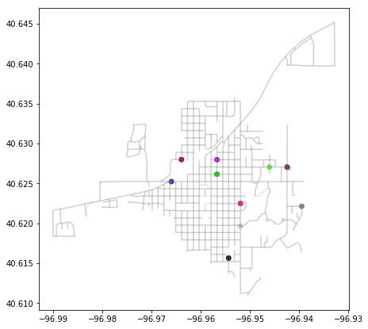


https://jakevdp.github.io/PythonDataScienceHandbook/05.11-k-means.html

Introducing k-Means
The k-means algorithm searches for a pre-determined number of clusters within an unlabeled multidimensional dataset. It accomplishes this using a simple conception of what the optimal clustering looks like:

* The "cluster center" is the arithmetic mean of all the points belonging to the cluster.
* Each point is closer to its own cluster center than to other cluster centers.

Those two assumptions are the basis of the k-means model. We will soon dive into exactly how the algorithm reaches this solution, but for now let's take a look at a simple dataset and see the k-means result.

First, let's generate a two-dimensional dataset containing four distinct blobs. To emphasize that this is an unsupervised algorithm, we will leave the labels out of the visualization


```python
gen_distances = nx.shortest_path_length(G, weight='length')
```


```python
distance_lookup = {}
for node, node_distances in gen_distances:
    distance_lookup[node] = node_distances
```


```python
def nearest_point(node, centers):
    node_distances = distance_lookup[node]
    nearest_node = min(centers, key=lambda x: node_distances[x])
    return nearest_node
```


```python
gdf_nodes['centroid'] = list(map(lambda node_id: nearest_point(node_id, gdf_means.index), gdf_nodes.index))
```


```python
gdf_nodes['color'] = list(map(lambda node: cmap_lookup[node], gdf_nodes['centroid'])) # there's a nicer way to do this
```


```python
plot_gdfs(gdf_nodes, gdf_edges)
```


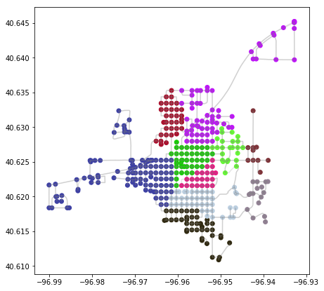


get the new centroids


```python
centroids = set(gdf_nodes['centroid'])
new_centroids = []
for centroid in centroids:
    cluster_nodes = gdf_nodes.loc[gdf_nodes['centroid']==centroid].index
    sub_G = G.subgraph(cluster_nodes)
    try:
        center = nx.center(sub_G)[0] # there could be multiple centers, note we could pass a set of eccentricities to this function call
    except nx.NetworkXError as e:
        print(centroid, e)
        new_centroids.append(centroid)
        continue
    new_centroids.append(center)
```


```python
gdf_nodes['centroid'] = list(map(lambda node_id: nearest_point(node_id, new_centroids), gdf_nodes.index))
```


```python
gdf_nodes['color'] = list(map(lambda node: cmap_lookup[node], gdf_nodes['centroid'])) # there's a nicer way to do this
```


```python
plot_gdfs(gdf_nodes, gdf_edges)
```


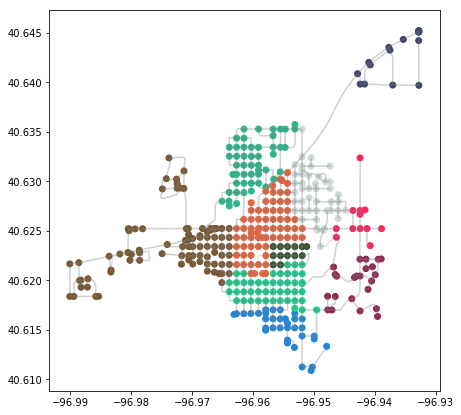


So, that was fun, let's tidy this all up and put it into some functions.


```python

def k_means_iter(centroids):
    gdf_nodes['centroid'] = list(map(lambda node_id: nearest_point(node_id, centroids), gdf_nodes.index))
    new_centroids = []
    for centroid in centroids:
        cluster_nodes = gdf_nodes.loc[gdf_nodes['centroid']==centroid].index
        sub_G = G.subgraph(cluster_nodes)
        try:
            center = nx.center(sub_G)[0] # there could be multiple centers, note we could pass a set of eccentricities to this function call
        except nx.NetworkXError as e:
            print(centroid, e)
            new_centroids.append(centroid)
            continue
        new_centroids.append(center)
    gdf_nodes['centroid'] = list(map(lambda node_id: nearest_point(node_id, new_centroids), gdf_nodes.index))
    gdf_nodes['color'] = list(map(lambda node: cmap_lookup[node], gdf_nodes['centroid'])) # there's a nicer way to do this
    centroids = new_centroids
    return centroids
    
```


```python
centroids = list(gdf_nodes.sample(k).index)
centroids
```


    [135776189,
     5084835883,
     135779353,
     5084811289,
     135777801,
     135771894,
     135781524,
     135767889,
     135786443,
     135787154]


```python
centroids = k_means_iter(centroids)
```

https://anaconda.org/ostrokach/graph-tool


```python
plot_gdfs(gdf_nodes, gdf_edges)
```


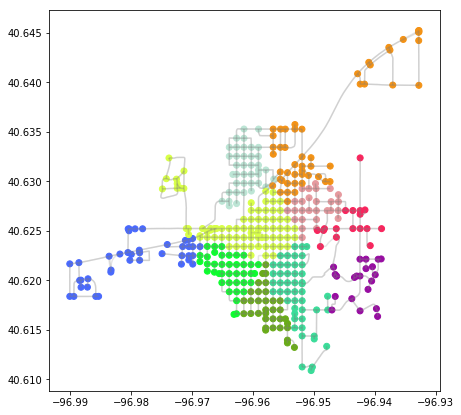


```python
centroids = k_means_iter(centroids)
```


```python
plot_gdfs(gdf_nodes, gdf_edges)
```


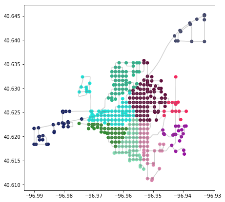


```python
centroids = k_means_iter(centroids)
```


```python
plot_gdfs(gdf_nodes, gdf_edges)
```


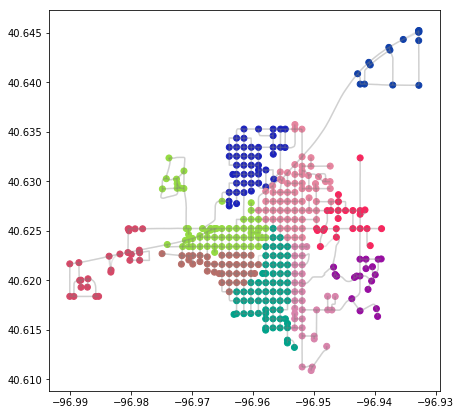


```python
centroids = k_means_iter(centroids)
```


```python
plot_gdfs(gdf_nodes, gdf_edges)
```


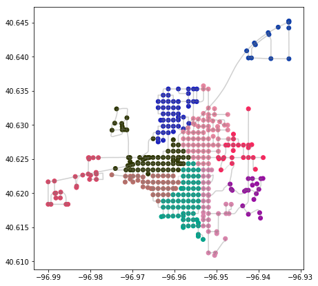


```python
centroids = k_means_iter(centroids)
```


```python
plot_gdfs(gdf_nodes, gdf_edges)
```


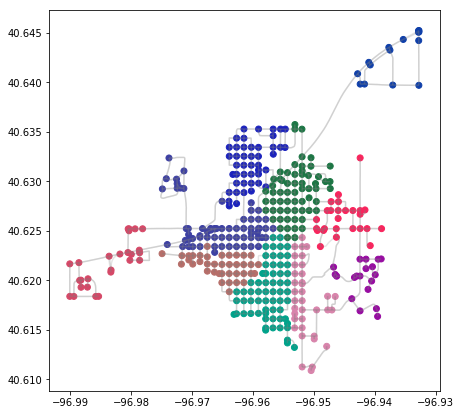


Notice how the last two plots didn't really change? This is becase the algorithm has converged upon a solution, so let's modify the code to terminate once this convergence has occured.


```python

def k_means_iter(centroids):
    gdf_nodes['centroid'] = list(map(lambda node_id: nearest_point(node_id, centroids), gdf_nodes.index))
    new_centroids = []
    for centroid in centroids:
        cluster_nodes = gdf_nodes.loc[gdf_nodes['centroid']==centroid].index
        sub_G = G.subgraph(cluster_nodes)
        try:
            center = nx.center(sub_G)[0] # there could be multiple centers, note we could pass a set of eccentricities to this function call
        except nx.NetworkXError as e:
            print(centroid, e)
            new_centroids.append(centroid)
            continue
        new_centroids.append(center)
    gdf_nodes['centroid'] = list(map(lambda node_id: nearest_point(node_id, new_centroids), gdf_nodes.index))
    gdf_nodes['color'] = list(map(lambda node: cmap_lookup[node], gdf_nodes['centroid'])) # there's a nicer way to do this
    if set(centroids) == set(new_centroids):
        return False
    return new_centroids
    
```


```python
centroids = list(gdf_nodes.sample(k).index)

while centroids:
    centroids = k_means_iter(centroids)
```


```python
plot_gdfs(gdf_nodes, gdf_edges)
```


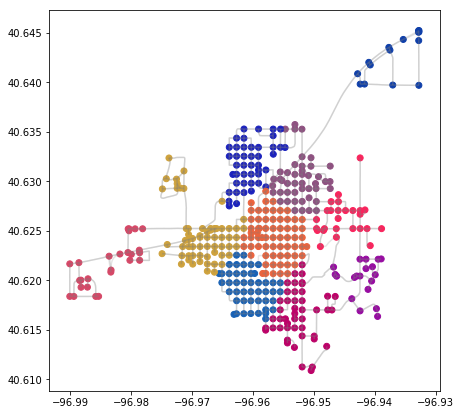

